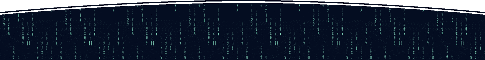

<h2 align="center">
    Hi, Human 🖖
</h2>

    <b>I'm Shivang, a Full Stack Developer who likes to dabble around with Data Science sometimes.</b>

    Welcome to my GitHub, here you can find all the projects that I have worked on.

 

    <i>Feel free to hit me up for discussing interesting ideas:</i>
      
    
    
    

    
    

---

    
More about me

    <ul>
        <li>🎓 Computer Science Grad</li>
        <li>🎯 Contribute and create open source projects</li>
        <li>📚 I'm always learning something new. Current hitlist : React | Scalable systems | Psychology </li>
        <li>💬 You can reach out to me for a quick chat. Ask me about Angular, Ionic, Node.js</li>
    </ul>

    
My GitHub stats

     
    

        
    

    

        
    

    

        
    

    

        
    

    

        
    

